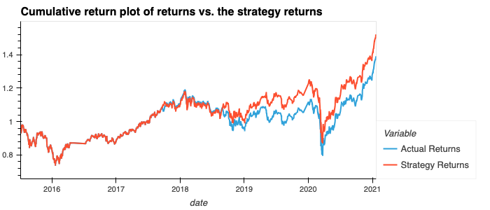
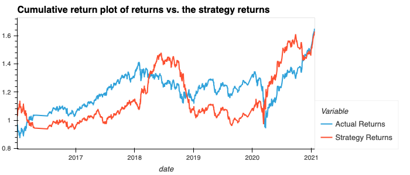
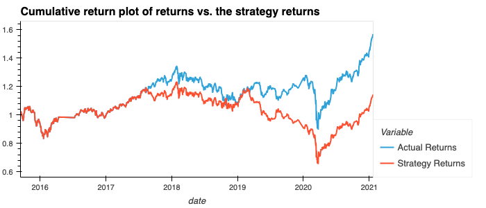

# Machine Learning Trading Bot

This application is designed to establish a baseline performance for a trading algorithm, tune it, evaluate it with a new machine learning classifier, and generate an evaluation report. It is an interactive and comprehensive tool for fine-tuning your trading strategies using different machine learning models and parameters.

## Technologies

This project leverages python 3.7 with the following packages:

* [Python 3.7.13](https://www.python.org/downloads/release/python-385/) - The programming language used in the project.
* [Pandas](https://pandas.pydata.org/) - A Python library used for efficient data manipulation.
* [Jupyter Lab](https://jupyter.org/) - An interactive development environment used to create and share documents containing live code, equations, visualizations, and narrative text.
* [Numpy](https://numpy.org/) - A library for the Python programming language, adding support for large, multi-dimensional arrays and matrices.
* [Scikit-learn 1.0.2](https://scikit-learn.org/stable/index.html) - A Python library containing efficient tools for machine learning and statistical modeling, including classification, regression, clustering, and dimensionality reduction.
* [hvPlot](https://hvplot.holoviz.org/): for creating interactive plots using Bokeh and HoloViews.
* [Selenium](https://www.selenium.dev/):  for automating web browser interactions.
* [hvPlot](https://www.selenium.dev/):

## Installation

* Install Python 3.7 (if not installed already)
* Download and install the Anaconda Python distribution, which includes Python, the Jupyter Notebook App, and other commonly used packages for scientific computing and data science.
* Start the Jupyter Notebook in your local environment.
* Open the project **machine_learning_trading_bot.ipyn** bJupyter Notebook file in the browser.

## Preprocessing Data

In the data preprocessing phase, we first import daily stock price data into a DataFrame. Then, daily and average returns for specific trading periods are computed. Trading signals based on these returns are created. After removing null values, the DataFrame is segmented into training and testing sets. Finally, the datasets are normalized using Scikit-Learn's StandardScaler. More details can be found in the Model Definitions section. 

#### Establish a Baseline Performance
First, you'll initialize the application by running the provided starter code to establish a baseline performance. This involves importing a dataset, generating trading signals, splitting the data into training and testing sets, fitting and predicting using an SVC classifier model, and creating visualizations and data frames for further analysis.

#### Tune the Baseline Trading Algorithm
Once the baseline is established, the next step involves tuning the algorithm. Adjust the size of the training dataset, tune the trading algorithm by tweaking the SMA input features, choose the optimal parameters, and record your results.

#### Evaluate a New Machine Learning Classifier
After tuning the baseline algorithm, you'll then implement a different machine learning classifier, backtest the model, evaluate its performance, and document your findings.

#### Create an Evaluation Report
At the end of your exploration, generate an evaluation report that summarizes your findings, conclusions, and provides visual support for your analysis.

## Descripton of the models: 

We have built and evaluated a total of four distinct machine learning models. The primary model serves as a baseline for comparison, with each of the subsequent three models introducing modifications to either the model type, short/long window length, or DateOffset value. Each of the models operates utilizing the default parameters for their respective model type.

#### Baseline Model

The baseline model employs a Support Vector Classifier, with the following parameters specified during the data preparation stage:

Variable | Value
--- | ---
"Short" window | 4 days
"Long" window | 100 days
DateOffset | 3 months

#### Alternate Model 1

The first alternate model also uses a Support Vector Classifier, but modifies the parameters for the data preparation stage as follows:

Variable | Value
--- | ---
"Short" window | 4 days
"Long" window | 100 days
DateOffset | 9 months

#### Alternate Model 2

The second alternate model maintains the use of a Support Vector Classifier but adjusts the parameters for the data preparation stage in this manner:

Variable | Value
--- | ---
"Short" window | 20 days
"Long" window | 200 days
DateOffset | 3 months

#### Alternate Model 3

The third alternate model diverges from the use of a Support Vector Classifier, opting instead for an AdaBoost Classifier, with the following parameters set during the data preparation stage:

Variable | Value
--- | ---
"Short" window | 10 days
"Long" window | 200 days
DateOffset | 3 months

### Contributors

Alexander Likhachev

### License
MIT
